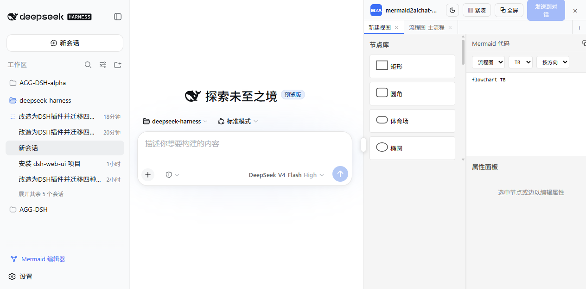

# mermaid2aichat-dsh

> Mermaid 可视化编辑器 — DeepSeek Harness（dsh）浏览器插件。
> 在 Web 前端右侧提供可关闭的编辑器面板：画布与 Mermaid 代码双向同步，并与 Agent 直接协作画图。



支持四种图表类型：**flowchart（流程图）、sequenceDiagram（时序图）、classDiagram（类图）、erDiagram（ER 图）**。
编辑器 UI 是核心，**不需要 MCP / 服务端 / VSCode 插件**——插件直接与 dsh 通信，对 dsh 源码零改动。

## 功能特性

**面板与布局**

- 侧边栏底部「Mermaid 编辑器」按钮打开/关闭；**页面内全屏**（⧉ 全屏）解决画布过小问题
- **聊天区让位 + 可调宽度**：布局控制器在 shell 网格上追加独立编辑器列，
  聊天区自动缩宽、不遮挡对话内容；列间把手拖宽（300–1200px，聊天区始终 ≥400px），双击复位
- 与 dsh 侧边栏、会话详情列、dsh-web-ui 右侧面板**互不遮蔽、可同时显示**（见「共存协议」）
- **响应式紧凑模式**：宽度 < 420px 时自动隐藏左右侧面板只留画布；「▥ 紧凑」可手动切换
- 独立暗色模式（标题栏明暗切换，仅作用于面板内部）

**编辑器**

- 可视化画布 ↔ Mermaid 代码双向同步（画布编辑 → 代码；代码编辑 → 画布，失焦或 Ctrl+Enter 提交）
- 类型切换：**代码区下拉选择器**（流程图/时序图/类图/ER图）或代码首行修改，弹窗确认；
  流程图方向（TB/TD/BT/RL/LR）与连线模式（按方向/就近）选择器同在代码区；复制代码按钮在代码区标题栏
- 节点库拖拽添加、连线、属性面板、子图/命名空间/实体/参与者等专用编辑器
- **会话隔离 + 多标签**：面板自动跟随当前会话，标签页按会话存储；
  新建/切换/关闭（确认弹窗）/双击重命名/拖拽排序，每个标签独立持有画布、代码与视口
- 画布与代码整值持久化到 localStorage，刷新/重开自动恢复

**与 Agent 协作（双向 Mermaid 传输）**

- **AI → 编辑器**：注册模型工具 `mermaid_load`（宿主全局层，无需改 preset），
  AI 调用后图表**自动导入**为新标签并自动打开面板展示
- **对话 → 编辑器**：响应式扫描当前会话中的 ```` ```mermaid ```` 代码块，
  侧边栏按钮角标提示，「从对话导入」一键解析为新标签
- **编辑器 → 对话**：「发送到对话」把活动标签的代码块送入当前会话
- **输入框引用**：输入 `/`，触发菜单的「mermaid」组列出当前会话标签页，选中即插入代码块

## 安装

### 方式一：npm 安装（推荐）

```sh
dsh plugin --profile web add mermaid2aichat-dsh
```

### 方式二：GitHub 安装

```sh
dsh plugin --profile web add github:supergameboy/mermaid2aichat-dsh
```

### 方式三：本地目录安装（开发调试）

```sh
dsh plugin --profile web add <本仓库路径>
```

> 仓库内已提交 `lib/` 构建产物，git 安装无需构建即可使用。
> 若 pnpm 提示阻止构建，按提示在 `$DSH_HOME/profiles/web/pnpm-workspace.yaml`
> 的 `allowBuilds` 中放行该包，或改用方式一。

安装后**重启 `dsh web`**（模型工具 `mermaid_load` 在宿主启动时注册），
刷新页面即可在侧边栏底部看到「Mermaid 编辑器」按钮。

## 与 Agent 协作示例

在对话中对 Agent 说：

> 把 XXX 的流程画成 flowchart 送到编辑器

Agent 调用 `mermaid_load` 工具后，图表自动出现在编辑器新标签页中（面板会同时打开）。
在编辑器里调整后，点「发送到对话」把修改后的代码送回会话；或在输入框输入 `/`
引用任意标签页的代码块。

## 架构

一个 npm 包同时是三种角色：

1. **bundle（补丁层）**：`dsh.bundle.patch` 指向 `cordis.patch.yml`，把插件注册为一行 `dsh.client` 组合；
2. **host 插件（节点半边）**：注册模型工具 `mermaid_load`（全局层，每个会话的 agent 可见）；
3. **client 插件（浏览器半边）**：注册启动按钮（`sidebar.footer.action`）、
   面板入口（`shell.overlay`）、输入触发源（`inputTriggers`）与 DOM 布局控制器（`client/layout.ts`）。

通信路径（无 MCP / 无服务端）：

```
编辑器画布 ──onCanvasChange──▶ 状态源 state.ts（localStorage 持久化，按会话隔离）
状态源 ──「发送到对话」──▶ SessionFace.prompt('queue')
AI 工具 mermaid_load ──执行──▶ 工具结果 ──▶ blocks 源扫描 ──▶ 自动导入
对话会话 ──blocks 可观测源──▶「从对话导入」──▶ 解析为新标签
输入框 '/' ──触发源「mermaid」──▶ 当前会话标签页 ──▶ 插入代码块到草稿
```

```
src/
  index.ts              节点半边（注册模型工具 mermaid_load）
  client/               DSH 插件（状态源 + 面板 + 启动按钮 + 触发源 + 对话扫描 + 布局控制器）
  editor/               编辑器 UI（画布、节点库、属性面板、代码编辑器）
  serializer/           解析/序列化器（4 种图表类型的 jison 解析器 + 序列化器）
cordis.patch.yml        bundle 补丁层
lib/                    构建产物（已提交，安装开箱即用）
```

编辑器与序列化器源码内联在 `lib/client.js`（`@xyflow/react`、`dagre-cluster-fix`、
`js-yaml` 全部打包进 bundle；react 等平台模块由 dsh shell 的模块表提供）。

## 布局与共存协议（为什么不需要改 dsh）

编辑器列是**布局控制器在 DOM 层追加的网格轨**：镜像 shell 写入的行内
`grid-template-columns`（2/3 轨兼容），把自己追加到末尾，与侧边栏、聊天区、
会话详情列完全解耦。不依赖 `ctx.layout` 服务、不遮蔽任何槽位、对宿主版本零要求。

dsh-web-ui（aionui-panel）的右侧文件树/预览面板使用同一类方案。检测到其面板列时，
控制器切换为协作协议：写入 6 轨（shell 3 轨 + 编辑器轨 + 预览轨 + 文件树轨），
编辑器列固定在对方列之前；对方写 5 轨时同帧读取其数值并恢复 6 轨；对方 HMR /
后挂载时序用「写纯 shell 3 轨推一把」收敛；内置写入爆发护栏防止观察器级联成环。
两者可同时显示、互不干扰。

## 开发

```sh
pnpm install      # 安装依赖
pnpm run build    # 构建 lib/index.js（节点半边）+ lib/client.js（浏览器半边）
pnpm run typecheck
pnpm run watch    # tsdown 监听重建
```

修改源码后重新 `pnpm run build`；节点半边（工具注册）需重启 `dsh web` 生效，
浏览器半边刷新页面即可。

## 已知限制

- 仅支持 flowchart / sequenceDiagram / classDiagram / erDiagram 四种图表类型，
  其它类型的解析会提示不支持
- 「从对话导入」只扫描当前会话**已加载的消息窗口**，分页之外的历史消息需先上滑加载
- 客户端 bundle 体积较大（内联 React Flow 等全部编辑器依赖），首次打开面板时按需拉取
- 输入框引用（`/` 触发源）只能替换草稿为代码块（`setDraft` 语义），不能追加到草稿尾部
- 编辑器列宽持久化只在拖拽、双击复位与窗口尺寸变化时回写；侧边栏/详情列开关
  只影响当次显示宽度，不修改偏好（与 dsh 自身布局偏好语义一致）

## License

[MIT](LICENSE)
